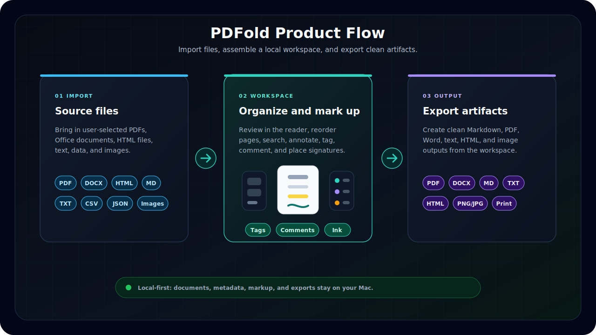
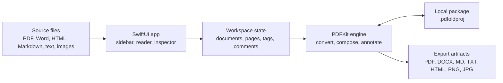
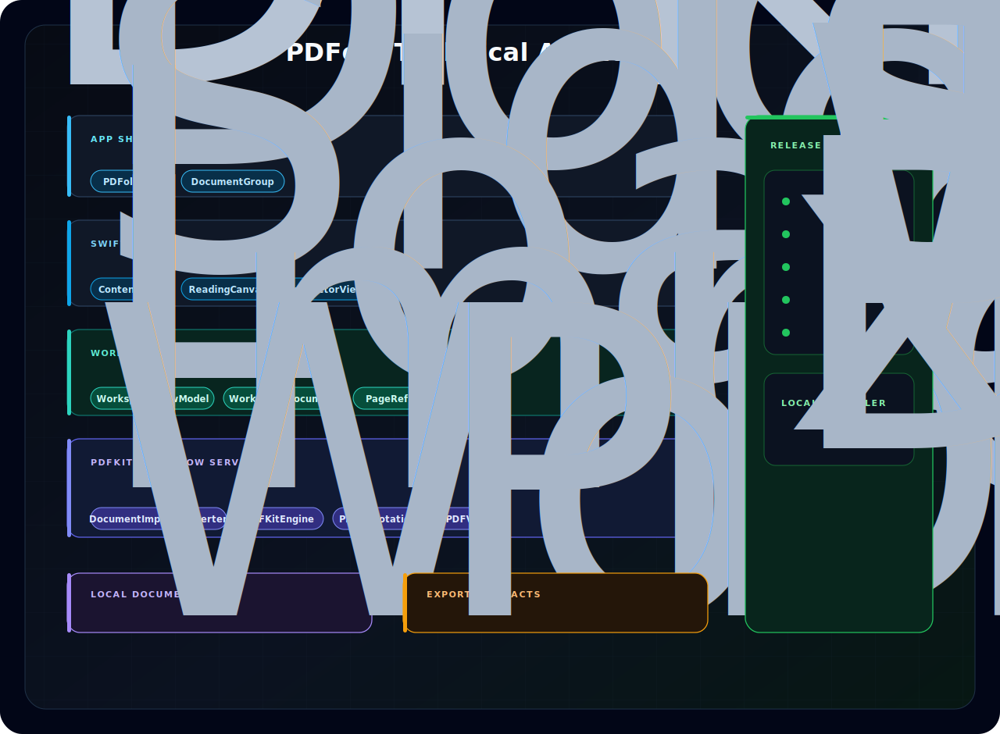

<br>

<p align="center">
  
</p>

<h1 align="center">PDFold</h1>

<p align="center">
  <em>A native macOS document workspace for turning a pile of files into one civilized PDF workflow.</em>
</p>

<p align="center">
  <strong>Native Mac document assembly, markup, signing, search, and export.</strong>
</p>

<p align="center">
  
  &nbsp;&nbsp;
  
  &nbsp;&nbsp;
  
</p>

<p align="center">
  
  &nbsp;&nbsp;
  
  &nbsp;&nbsp;
  
</p>

<p align="center">
  
  &nbsp;&nbsp;
  
  &nbsp;&nbsp;
  
</p>

<p align="center">
  <a href="#simplest-local-setup">⚡&nbsp;<strong>Setup</strong></a>
  &nbsp;&nbsp;&nbsp;
  <a href="#what-it-does">✨&nbsp;<strong>Features</strong></a>
  &nbsp;&nbsp;&nbsp;
  <a href="#architecture">🏗️&nbsp;<strong>Architecture</strong></a>
  &nbsp;&nbsp;&nbsp;
  <a href="#release-status">🚢&nbsp;<strong>Release</strong></a>
  &nbsp;&nbsp;&nbsp;
  <a href="#quality-checks">✅&nbsp;<strong>Quality</strong></a>
  &nbsp;&nbsp;&nbsp;
  <a href="#troubleshooting">🧰&nbsp;<strong>Help</strong></a>
</p>

---

## Quick Start

**Prerequisite:** [Xcode 15+](https://developer.apple.com/xcode/) on macOS 14 Sonoma or newer.

1. Clone or download this repository
2. Double-click **`Install or Update PDFold.app`** in the project folder — it builds, signs, and installs the app to `~/Applications`
3. Open **PDFold** from the Desktop shortcut or `~/Applications/PDFold.app`

To update: pull the latest code and double-click the installer again.

<details>
<summary>Terminal path</summary>

```zsh
git clone https://github.com/udhawan97/PDFold.git
cd PDFold
./scripts/install-mac.sh
```
</details>

---

## The Short Version

> Personal pain point, professionally over-engineered into a native Mac app.

PDFold is a local-first macOS application that transforms scattered documents into a single, organized PDF workspace. It supports importing PDFs, Word documents, HTML, Markdown, text files, structured data files, and images, then provides tools to read, organize, annotate, tag, comment, sign, search, save, print, and export them efficiently.

I built PDFold to solve a real workflow problem I kept running into: important documents rarely arrive as one clean, final file. They often come as multiple attachments, revisions, screenshots, forms, and supporting files that need to be reviewed and shared together.

PDFold brings that fragmented process into one focused workspace, making document handling faster, cleaner, and easier to manage.

## At A Glance

|  | Signal | Why It Matters |
| --- | --- | --- |
| 🖥️ | Native macOS | SwiftUI, PDFKit, document-based app architecture, sandboxed file access |
| 🔒 | Local-first | No accounts, no upload pipeline, no "where did my documents go?" subplot |
| 🧭 | Real workflow | Import, combine, annotate, tag, comment, search, sign, save, print, export |
| ⚡ | Simple setup | Download or clone the repo, then run the local installer |
| ✅ | Release-ready | Installer build, crash hardening, syntax checks, and README hygiene are part of the project workflow |
| 🧑‍💼 | Portfolio-ready | Clear product problem, practical engineering, user-facing polish |

## Who This Is For

|  | Audience | What to Notice |
| --- | --- | --- |
| 🧑‍💼 | Recruiters | A polished native macOS app with a clear user problem, visible product thinking, and practical engineering choices. |
| 🧑‍💻 | Developers | SwiftUI, PDFKit, document packages, custom import conversion, metadata persistence, multi-format export, undo-aware page operations, crash hardening, and installer automation. |
| 📎 | Actual humans with PDFs | Drag files in, make sense of them, sign what needs signing, export one clean document, and move on with your day. |

## What It Does

|  | Capability | Details |
| --- | --- | --- |
| 📥 | Import | PDFs, Word docs, HTML, RTF, Markdown, plain text, CSV, JSON, XML, and images |
| 🗂️ | Organize | Combine files, reorder source documents, move pages within documents, rotate pages, and delete pages |
| 📖 | Read | Native PDF canvas, generated section banners, table of contents, sidebar navigation, inspector views, and search |
| ✍️ | Mark up | Highlight, note, editable text overlay, ink, underline, strikeout, and signature tools |
| 🏷️ | Track | Workspace tags, workspace comments, and an inspector markup list for reviewing annotations |
| 💾 | Save | Editable `.pdfoldproj` document packages with workspace metadata, tags, comments, signatures, and source PDF data |
| 📤 | Export | PDF, Word `.docx`, Markdown `.md`, text, HTML, PNG pages, JPEG pages, or printable workspace |
| 🔑 | Unlock | Password-protected PDF prompt using native PDFKit behavior |
| 🛡️ | Protect | Local-first by design; your files stay on your Mac |

## Product Flow

<p align="center">
  
</p>

<p align="center">
  <em>From scattered files to a local editable workspace, then out to clean shareable artifacts.</em>
</p>

## Architecture



<p align="center">
  
</p>

<p align="center">
  <em>High-level flow first, then the implementation view: SwiftUI views, observable workspace state, PDFKit services, local packages, exports, and release guardrails.</em>
</p>

|  | Layer | Responsibility |
| --- | --- | --- |
| 🖥️ | SwiftUI app | Presents the workspace, sidebar, reader, tools, search, and export actions |
| ⚙️ | Document engine | Converts imports, builds the combined PDF, manages annotations, and writes exports |
| 💾 | Local storage | Keeps editable `.pdfoldproj` packages and generated output on the user's Mac |

## Why It Matters

Most PDF tools either feel like a full-time job or only solve one tiny part of the workflow. PDFold aims for the middle: focused enough to be fast, native enough to feel at home on macOS, and practical enough to handle the document chaos that shows up in real life.

The app is intentionally local-first. No account. No upload step. No mysterious cloud conveyor belt. Just your Mac, your files, and a small amount of hard-earned order.

## Release Status

PDFold is prepared for version `2.0`: a release-hardened local-first macOS workflow for collecting scattered documents, turning them into one workspace, marking them up, tracking workspace context, and exporting a clean result.

|  | Detail | Status |
| --- | --- | --- |
| 🚢 | Version | `2.0` |
| 🧾 | App metadata | `CFBundleShortVersionString` `2.0`, `CFBundleVersion` `2` |
| ⚡ | Install path | Download or clone the repo, then run the local installer/updater |
| 🧪 | Smoke test | `./scripts/install-mac.sh --no-open` |
| 🔐 | Signing | Local ad-hoc signing for development/source distribution |
| 📦 | Distribution style | Source distribution; no notarized binary is included |

### What Changed In v2

|  | Area | Release Hardening |
| --- | --- | --- |
| 🏷️ | Workspace context | Tags and workspace comments are persisted in `.pdfoldproj` packages, with inspector tabs for metadata, tags, comments, and markup review. |
| ✍️ | Text editing | The text tool can create clean free-text boxes or convert selected PDF text into an editable overlay. |
| 🖊️ | Ink stability | Ink annotations now use PDFKit-native paths, and malformed legacy ink data is sanitized before display to prevent PDFKit drawing crashes. |
| 🛡️ | Import safety | Import failures now show actionable messages, oversized files are rejected before loading, and dragged/selected files use security-scoped access. |
| 🔐 | Protected PDFs | Password-protected documents unlock from the already-loaded PDF instance instead of reopening the file after sandbox access may have ended. |
| ↩️ | Undo reliability | Page deletion and page reordering undo restore serialized PDF state, not only sidebar metadata. |
| 🗂️ | Page order | Reordered pages now rebuild the workspace page map correctly, keeping navigation, export, signatures, and saved projects aligned. |
| 📤 | Export reliability | PDF and multi-format exports now report write failures instead of failing silently. |
| 🧯 | Crash hardening | Document reordering, page operations, PDF serialization, HTML rendering, image export, and signature storage now guard failure cases instead of assuming ideal input. |

## Simplest Local Setup

The installer is one double-click after the project is on your Mac.

|  | Step | Action |
| --- | --- | --- |
| 📦 | 1 | Download or clone this repository from GitHub |
| ⚡ | 2 | Open the project folder in Finder and double-click `Install or Update PDFold.app` |
| 🏗️ | 3 | Let it build PDFold locally |
| 🚀 | 4 | Use the `PDFold` Desktop launcher it creates |

That is it. The installer puts the app in `~/Applications/PDFold.app`, refreshes a Desktop launcher named `PDFold`, signs the local build ad-hoc, opens the app, and writes a setup log to `.build/install.log`.

No admin password, no global package manager, no "please install five unrelated things because a PDF app sneezed" detour.

Important GitHub note: clicking installer files inside the GitHub README opens them in the browser. Browsers cannot run local Mac installer scripts or apps from a README link. Download or clone the repository first, then double-click the installer app from Finder.

<details>
<summary>Fresh install from Terminal</summary>

```zsh
git clone https://github.com/udhawan97/PDFold.git
cd PDFold
./scripts/install-mac.sh
```
</details>

## Updating The App

To update PDFold locally:

1. Pull the latest project code, or download a fresh copy from GitHub.
2. Open the project folder in Finder.
3. Double-click `Install or Update PDFold.app` again.

The installer is intentionally repeatable. If PDFold is already installed, it rebuilds the latest code, closes the running app if needed, replaces `~/Applications/PDFold.app`, refreshes the Desktop launcher, and opens the updated app.

<details>
<summary>Prefer Terminal?</summary>

```zsh
git pull
./scripts/install-mac.sh
```

Useful terminal options:

```zsh
./scripts/install-mac.sh --clean
./scripts/install-mac.sh --no-open
./scripts/install-mac.sh --help
```

The terminal script performs the same install/update flow as the double-click version.
</details>

## Requirements

|  | Requirement | Version |
| --- | --- | --- |
| 🍎 | macOS | 14 Sonoma or newer |
| 🧰 | Xcode | 15 or newer |
| 🦅 | Swift | 5.9 |

<details>
<summary>Why Xcode?</summary>

PDFold is a native SwiftUI document app. The setup script uses `xcodebuild` to produce a real `.app` bundle, copy it into your user Applications folder, apply a local ad-hoc signature, and create a Desktop launcher that behaves like a normal Mac app.
</details>

## Daily Workflow

1. Launch PDFold.
2. Drag in one or more files.
3. Read, reorder, annotate, tag, comment, search, sign, rotate, or remove pages.
4. Review workspace metadata, tags, comments, and markup in the inspector.
5. Save a `.pdfoldproj` workspace if you want to keep editing later.
6. Export a PDF, Word document, Markdown file, text file, HTML file, or page images when you need to share the workspace in a useful format.

## Technical Layout

```text
PDFold/
  App/             App entry point and command wiring
  Document/        macOS document package read/write support
  Engine/          PDF loading, conversion, concatenation, manifests, export helpers
  Models/          Workspace, page, annotation, and signature data models
  Resources/       App metadata, entitlements, and asset catalogs
  ViewModels/      Workspace state, document operations, search, export, undo
  Views/           SwiftUI interface components
scripts/
  install-mac.command  Compatibility double-click installer
  install-mac.sh       Terminal installer
Install or Update PDFold.app
  Finder installer/updater that bypasses Terminal shell startup
Install or Update PDFold.command
  Compatibility Terminal installer/updater
```

## Developer Notes

Open the project in Xcode:

```zsh
open PDFold.xcodeproj
```

Build from the command line:

```zsh
xcodebuild -project PDFold.xcodeproj -scheme PDFold -configuration Debug build
```

Run the same release build path used by the installer:

```zsh
xcodebuild \
  -project PDFold.xcodeproj \
  -scheme PDFold \
  -configuration Release \
  -derivedDataPath .build/xcode \
  CODE_SIGNING_ALLOWED=NO \
  build
```

Or use the installer in no-open mode:

```zsh
./scripts/install-mac.sh --no-open
```

## Privacy & Security

PDFold is a local-first Mac app. Documents are opened, edited, saved, and exported on your machine.

The app uses macOS sandboxing and file access through user-selected documents. In normal-person English: it handles the files you give it, not your entire digital attic.

Release v2 also adds practical guardrails around the most failure-prone paths:

- Files larger than 512 MB are rejected before loading to avoid memory pressure from accidental giant imports.
- PDF serialization failures preserve existing package data or report an actionable import error instead of writing broken workspace state.
- Malformed legacy ink annotations are rebuilt before display so PDFKit does not crash while drawing them.
- HTML rendering, image export, page operations, and signature storage now guard invalid or unavailable state.
- Export failures are surfaced to the user, including failed writes and image-rendering errors.

<details>
<summary>Sandbox details</summary>

The app enables:

- `com.apple.security.app-sandbox`
- `com.apple.security.files.user-selected.read-write`

These entitlements allow sandboxed read/write access to files selected by the user.
</details>

## Quality Checks

Before shipping a build, verify the app from both sides: the developer path and the human-with-documents path.

|  | Check | What To Verify |
| --- | --- | --- |
| ✅ | Build | `xcodebuild` completes for the `PDFold` scheme |
| 🧪 | Installer smoke test | `./scripts/install-mac.sh --no-open` builds, signs, installs, and refreshes the launcher |
| 📥 | Import | Drag-and-drop works with multiple supported file types |
| 🔑 | Protected PDFs | Password-protected PDFs show the unlock flow |
| 💾 | Persistence | `.pdfoldproj` packages save and reopen correctly |
| 🔎 | Search | Search results work across the combined workspace |
| 🏷️ | Inspector | Tags, comments, info, and markup tabs reflect workspace state |
| ✍️ | Annotation | Highlight, note, editable text, ink, underline, strikeout, and undo behavior work |
| 🗂️ | Pages | Page rotation, deletion, and reordering behave correctly |
| 📤 | Export | PDF, Word, Markdown, text, HTML, PNG, and JPEG exports complete successfully |
| 🚀 | Launch | Desktop launcher opens the installed app after running the installer |

For v2 release preparation, the local verification pass should include:

```zsh
plutil -lint PDFold/Resources/Info.plist
plutil -lint PDFold/Resources/PDFold.entitlements
zsh -n scripts/install-mac.sh
zsh -n scripts/install-mac.command
zsh -n "Install or Update PDFold.command"
plutil -lint "Install or Update PDFold.app/Contents/Info.plist"
swift build
xcodebuild -project PDFold.xcodeproj -scheme PDFold -configuration Debug CODE_SIGNING_ALLOWED=NO SWIFT_TREAT_WARNINGS_AS_ERRORS=YES build
```

## Roadmap

- Richer signature management.
- More export presets.
- Improved document thumbnails and faster page navigation.
- Automated UI smoke tests.
- Notarized release builds for easier distribution.

## Contributing

Good contributions are focused, tested, and kind to the next person reading the code at 11:47 PM.

1. Create a focused branch.
2. Keep changes scoped.
3. Run a local build.
4. Include screenshots or notes for UI changes.
5. Open a pull request with the problem, approach, and verification steps.

## Troubleshooting

<details>
<summary>Clicking the installer opens a GitHub page instead of installing</summary>

That is expected on GitHub. README links open files in the browser; they do not execute Mac installer scripts.

Download or clone the repository first, then open the downloaded `PDFold` folder in Finder and double-click `Install or Update PDFold.app`.
</details>

<details>
<summary>Double-clicking the installer says it cannot be opened</summary>

Open Terminal in the project folder and run:

```zsh
chmod +x "Install or Update PDFold.command" "Install or Update PDFold.app/Contents/MacOS/PDFoldInstaller" scripts/install-mac.sh scripts/install-mac.command
```

Then double-click `Install or Update PDFold.app` again from Finder.
</details>

<details>
<summary>The installer says Xcode is missing or not ready</summary>

Install Xcode from the Mac App Store, then open it once so macOS can finish setup. After that, run the installer again.

If Xcode is installed but still not ready, run:

```zsh
xcodebuild -version
```

macOS may ask you to accept the Xcode license or finish installing command line tools.
</details>

<details>
<summary>The Desktop launcher does not open the app</summary>

Run `Install or Update PDFold.app` again from Finder. It refreshes `~/Applications/PDFold.app` and recreates the Desktop launcher.
</details>

<details>
<summary>macOS warns the app is from an unidentified developer</summary>

This local development build is not notarized. Open it from Finder, then use **Open** from the security prompt. For distributed releases, sign and notarize the app with an Apple Developer account.
</details>

<details>
<summary>The app did not update</summary>

Make sure you pulled or downloaded the latest project code first, then run the installer again.

For a fully fresh local build:

```zsh
./scripts/install-mac.sh --clean
```
</details>

<details>
<summary>The build fails and the terminal window closes too fast</summary>

Open `.build/install.log` in the project folder. It contains the latest installer/build output.

You can also run the installer from Terminal to keep the output visible:

```zsh
./scripts/install-mac.sh
```
</details>

## License

PDFold is available under the [MIT License](LICENSE).
