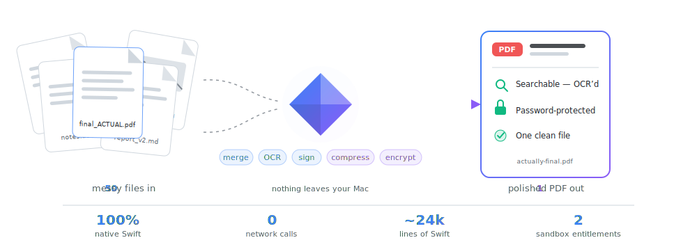
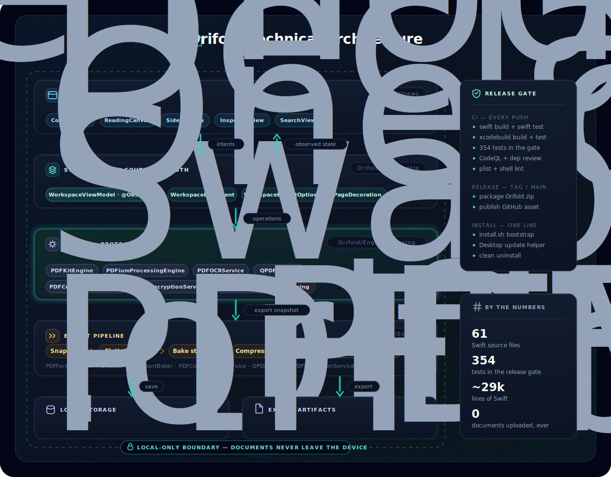
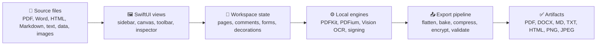

<div align="center">


# Orifold

### Drop in up to 50 messy files.<br>Walk away with one polished, searchable, password-protected PDF.

<em>Designed from necessity &nbsp;·&nbsp; Built for privacy &nbsp;·&nbsp; Refined for focus</em>

<br>

<picture>
  <source media="(prefers-color-scheme: dark)" srcset="docs/assets/hero-banner-dark.svg">
  
</picture>

<picture>
  <source media="(prefers-color-scheme: dark)" srcset="docs/assets/value-props-dark.svg">
  
</picture>

<br>

&nbsp;&nbsp;&nbsp;&nbsp;&nbsp;&nbsp;

<br>
<br>

<sub><strong>Built with</strong></sub><br>


<br>
<br>
<br>

<a href="#-install-in-30-seconds"><kbd> &nbsp;⚡ Install&nbsp; </kbd></a>&ensp;
<a href="#-what-it-does"><kbd> &nbsp;✨ Features&nbsp; </kbd></a>&ensp;
<a href="#-privacy"><kbd> &nbsp;🔒 Privacy&nbsp; </kbd></a>&ensp;
<a href="#%EF%B8%8F-under-the-hood"><kbd> &nbsp;⚙️ Under the Hood&nbsp; </kbd></a>&ensp;
<a href="#-troubleshooting"><kbd> &nbsp;🆘 Help&nbsp; </kbd></a>

</div>

---

## 📄 The Problem

A "simple PDF task" is never simple. It's six PDFs, two screenshots, a Word document, a scanned form, and a file named `final_final_revised_ACTUAL.pdf`.

Preview gives up the moment more than one file is involved. Acrobat does everything — for a subscription, with a cloud attached. **Orifold sits in the gap**: merge, annotate, OCR, forms, stamps, compression, and password protection — native, local, and free.

<p align="center">
  
</p>

## ⚡ Install in 30 Seconds

Paste this into Terminal and press Return:

```zsh
curl -fsSL https://raw.githubusercontent.com/udhawan97/Orifold/main/install.sh | zsh
```

That's it. The installer downloads the prebuilt app to `~/Applications/Orifold.app` and puts two helpers on your Desktop: **Orifold.command** (launch + auto-update) and **Uninstall Orifold.command** (a clean exit).

No Xcode. No GitHub account. No compile step. Requires macOS 14 Sonoma or newer — that's the whole list.

> [!TIP]
> Never used Terminal? Open **Applications → Utilities → Terminal**, paste the line above, press Return. You're now a power user.

<details>
<summary>🍺 &nbsp;Prefer Homebrew?</summary>

<br>

```zsh
brew tap udhawan97/orifold https://github.com/udhawan97/Orifold
brew install --cask udhawan97/orifold/orifold
```

Installs the same prebuilt app and clears the download quarantine. The one-line installer is still the friendliest path — it also creates the Desktop launch/update and uninstall helpers.
</details>

<details>
<summary>📥 &nbsp;Prefer a direct download?</summary>

<br>

Grab [`Orifold.zip`](https://github.com/udhawan97/Orifold/releases/latest/download/Orifold.zip) from the latest release, unzip, and drag `Orifold.app` into Applications. If macOS complains about an unidentified developer, right-click the app and choose **Open**.
</details>

<details>
<summary>🛠️ &nbsp;Building from source?</summary>

<br>

Source builds need Apple Command Line Tools with Swift 5.9+. The normal installer never needs them — it downloads a prebuilt app. See [Under the Hood](#%EF%B8%8F-under-the-hood).
</details>

## ✨ What It Does

Everything below runs on your Mac. The cloud was not consulted.

| | Do this | Get this |
| :---: | --- | --- |
| 📥 | **Import anything** — PDFs, Word, images, scans, Markdown, HTML, CSV | One workspace instead of a folder of chaos |
| 🗂️ | **Organize** — reorder, rotate, delete pages across documents | A clean packet from messy source files |
| ✏️ | **Annotate & edit** — highlight, notes, ink, text boxes, edit PDF text in place | Reviewed documents without a print-sign-scan loop |
| 🖋️ | **Sign & fill forms** — draw signatures, complete form fields, lock answers | Finished paperwork, no third-party e-sign service |
| 🔍 | **OCR scans** — local Vision OCR makes scanned pages searchable | ⌘F finally works on that thing your printer emailed you |
| 🏷️ | **Stamp & label** — watermarks, page numbers, Bates labels | Packets and exhibits that look intentional |
| 🗜️ | **Compress** — downsample oversized images, validate the result | Attachments that stop bouncing off email size limits |
| 🔒 | **Protect & export** — password-protect, or export DOCX, Markdown, HTML, PNG, JPEG | The format the next person actually needs |

> [!TIP]
> **Meet Foldy 🤝** — Orifold ships with a small built-in buddy who reacts to what you do with short tips and the occasional wisecrack ("Highlighted. Future-you will pretend they read the rest."). Helpful when you're new, easy to silence when you're not: toggle **Show Orifold Buddy** from the app's menu.

<details>
<summary>📋 &nbsp;Full capability list, feature by feature</summary>

<br>

| Area | What you can do |
| --- | --- |
| **Import** | Open PDFs, Word documents, HTML, Markdown, text, CSV, JSON, XML, and common image formats — up to 50 files per workspace |
| **Organize** | Reorder documents and pages, rotate, delete, add section banners, navigate from the sidebar |
| **Read & search** | Native PDF canvas, page indicator, inspector, workspace-wide search, password unlock prompts |
| **Annotate** | Highlight, notes, ink, underline, strikeout, text boxes, and in-place editing of detected PDF text |
| **Comments & metadata** | Workspace comments, tags, document details, inspector-visible annotation lists |
| **Signatures** | Draw and place signatures, export signed PDFs locally |
| **Forms** | Detect PDF form fields, edit answers, reset forms, lock answers during export |
| **Scans & OCR** | Local Vision OCR makes scans searchable; recognized text survives export |
| **Stamps & decorations** | Watermarks, page numbers, Bates labels, movable stamps burned into exported PDFs |
| **Compression** | Downsample oversized PDF images with post-compression validation |
| **Protection** | Password-protected export with permission checks and post-export verification |
| **Export** | PDF, DOCX, Markdown, plain text, HTML, PNG pages, JPEG pages, or print |
| **Install & update** | One-line installer, Desktop launch/update helpers, clean uninstaller, Homebrew cask |
</details>

## 💡 Three Tips Worth Knowing

1. **Merging isn't a separate step.** Drop files in, rearrange pages in the sidebar until the workspace tells the story you need, export once.
2. **Flatten before sharing.** Locking form answers and baking stamps at export means nobody "accidentally" edits your final copy.
3. **⌘Z is fearless.** Page deletes, rotations, and edits all live in undo history, so experiment freely.

## 🔒 Privacy

Orifold is local-first by design — not as a setting, as an architecture.

- 🖥️ **Everything runs on your Mac.** Import, OCR, compression, encryption, and export never touch a network.
- 🛡️ **Sandboxed.** The app uses macOS App Sandbox with user-selected file access only.
- 📡 **Zero telemetry.** There is no analytics pipeline. There isn't even a server to send it to.

<details>
<summary>🔍 &nbsp;The fine print (sandbox entitlements & guardrails)</summary>

<br>

The app enables exactly two entitlements:

- `com.apple.security.app-sandbox`
- `com.apple.security.files.user-selected.read-write`

Practical guardrails include password prompts for protected PDFs, import size limits, local validation before and after compression or encryption, form flattening before decoration burn-in, export error reporting for malformed PDFs or failed writes, and hidden Orifold comment metadata stripped before flat PDF export.
</details>

## 🔄 Updating & Uninstalling

**Update:** double-click **Orifold.command** on your Desktop. It checks the latest release before launching. That's the entire procedure — you may cancel the calendar reminder.

**Uninstall:** double-click **Uninstall Orifold.command**. It removes the app, the Desktop helpers, the installer cache, and app data — a cleaner exit than most software manages.

<details>
<summary>⚙️ &nbsp;Homebrew and advanced options</summary>

<br>

Update via Homebrew:

```zsh
brew update
brew upgrade --cask udhawan97/orifold/orifold
```

Uninstall via Homebrew:

```zsh
brew uninstall --cask udhawan97/orifold/orifold
```

Uninstall but keep preferences, caches, and sandbox data:

```zsh
curl -fsSL https://raw.githubusercontent.com/udhawan97/Orifold/main/scripts/uninstall-mac.sh | zsh -s -- --keep-user-data
```
</details>

## 🏗️ Under the Hood

*For developers, contributors, and anyone evaluating how this is built.*

| | |
| --- | --- |
| **Language** | Swift 5.9+, 100% SwiftUI interface |
| **Codebase** | 51 Swift source files, ~24,000 lines |
| **Tests** | 247 tests gating every release |
| **PDF engines** | PDFKit (composition) + PDFium (validation & compression) + Vision (OCR) |
| **Architecture** | Unidirectional flow: views → one observable view model → protocol-seamed local engines → staged export pipeline |
| **Distribution** | GitHub Actions builds the release zip; installer, Homebrew cask, and uninstaller ship from this repo |

<p align="center">
  
</p>

<details>
<summary>🧱 &nbsp;Layer-by-layer responsibilities</summary>

<br>

| Layer | Responsibility |
| --- | --- |
| SwiftUI app | Document window, sidebar, canvas, annotation toolbar, search, inspector, password prompts, export controls |
| Workspace state | Imported documents, page order, undo snapshots, comments, tags, signatures, form summaries, decorations |
| PDF services | PDFKit composition, PDFium validation and compression, Vision OCR, encryption, form flattening, decoration baking, signing helpers |
| Local storage | Saved PDF data, workspace metadata, source payloads, comments, signatures, page edit state |
| Release tooling | One-line installer, package builder, Desktop update launcher, uninstaller, GitHub Actions release asset, validation tests |


</details>

<details>
<summary>📁 &nbsp;Project layout</summary>

<br>

```text
Orifold/
  App/             App entry point and command wiring
  DesignSystem/    Shared visual tokens and styling
  Document/        macOS document package read/write support
  Engine/          PDF loading, conversion, OCR, compression, encryption, forms, export
  Models/          Workspace, page, annotation, comment, export, and decoration models
  Pet/             Foldy, the in-app buddy
  Resources/       App metadata, entitlements, assets
  Signing/         Signing identities, CMS construction, timestamping, verification
  ViewModels/      Workspace state, document operations, search, export, undo
  Views/           SwiftUI interface components
Tests/             Test suites run in the release gate
scripts/
  install-mac.sh   Release-first installer, source builder, release packager
  uninstall-mac.sh Clean uninstaller
install.sh         Hosted one-line bootstrap
Casks/orifold.rb   Homebrew cask
```
</details>

<details>
<summary>🔨 &nbsp;Build, test, and package</summary>

<br>

Open in Xcode:

```zsh
open Orifold.xcodeproj
```

Build and test:

```zsh
swift build
swift test
xcodebuild build -quiet -project Orifold.xcodeproj -scheme Orifold -destination 'generic/platform=macOS' CODE_SIGNING_ALLOWED=NO
xcodebuild test -quiet -project Orifold.xcodeproj -scheme Orifold -destination 'platform=macOS' CODE_SIGNING_ALLOWED=NO
```

Create the same release zip GitHub Releases ships:

```zsh
./scripts/install-mac.sh --package-only --package /tmp/Orifold.zip
```

Install from the current source checkout without opening the app:

```zsh
./scripts/install-mac.sh --no-open
```

App metadata: `CFBundleShortVersionString` `v6`, `CFBundleVersion` `6`.
</details>

<details>
<summary>✍️ &nbsp;Signed & notarized release builds</summary>

<br>

```zsh
ORIFOLD_SIGNING_IDENTITY="Developer ID Application: Your Name (TEAMID)" \
ORIFOLD_NOTARIZE=1 \
ORIFOLD_APPLE_ID="apple-id@example.com" \
ORIFOLD_APPLE_TEAM_ID="TEAMID" \
ORIFOLD_APPLE_APP_SPECIFIC_PASSWORD="app-specific-password" \
./scripts/install-mac.sh --package-only --package /tmp/Orifold.zip
```

GitHub Actions uses the same path when these secrets are configured: `ORIFOLD_DEVELOPER_ID_CERTIFICATE_BASE64`, `ORIFOLD_DEVELOPER_ID_CERTIFICATE_PASSWORD`, `ORIFOLD_SIGNING_IDENTITY`, `ORIFOLD_APPLE_ID`, `ORIFOLD_APPLE_TEAM_ID`, `ORIFOLD_APPLE_APP_SPECIFIC_PASSWORD`.
</details>

<details>
<summary>✅ &nbsp;Release gate — every command that must pass before shipping</summary>

<br>

```zsh
plutil -lint Orifold/Resources/Info.plist
plutil -lint Orifold/Resources/Orifold.entitlements
zsh -n install.sh
zsh -n scripts/install-mac.sh
zsh -n scripts/uninstall-mac.sh
zsh -n scripts/install-mac.command
zsh -n "Install or Update Orifold.command"
zsh -n "Uninstall Orifold.command"
zsh -n "Install or Update Orifold.app/Contents/MacOS/OrifoldInstaller"
plutil -lint "Install or Update Orifold.app/Contents/Info.plist"
swift build
swift test
xcodebuild build -quiet -project Orifold.xcodeproj -scheme Orifold -destination 'generic/platform=macOS' CODE_SIGNING_ALLOWED=NO
xcodebuild test -quiet -project Orifold.xcodeproj -scheme Orifold -destination 'platform=macOS' CODE_SIGNING_ALLOWED=NO
./scripts/install-mac.sh --package-only --package /tmp/Orifold.zip
```

Plus a manual pass on the user workflow: import, search, annotate, forms, OCR, stamps, compression, protected export, update, uninstall.
</details>

## 🔧 Troubleshooting

<details>
<summary>Clicking the installer link opens a GitHub page instead of installing</summary>

<br>

That's expected — README links open files in the browser; they don't execute installer scripts. Copy the [install command](#-install-in-30-seconds) into Terminal instead.
</details>

<details>
<summary>macOS warns the app is from an unidentified developer</summary>

<br>

Release builds are ad-hoc signed but not notarized. The one-line installer and Homebrew cask clear the download quarantine automatically. If macOS still warns, right-click the app in Finder and choose **Open** from the security prompt.
</details>

<details>
<summary>Double-clicking a <code>.command</code> file says it cannot be opened</summary>

<br>

Open Terminal in the project folder and run:

```zsh
chmod +x "Install or Update Orifold.command" "Uninstall Orifold.command" "Install or Update Orifold.app/Contents/MacOS/OrifoldInstaller" scripts/install-mac.sh scripts/install-mac.command scripts/uninstall-mac.sh
```

Then double-click `Install or Update Orifold.app` again from Finder.
</details>

<details>
<summary>The installer says no prebuilt release is available</summary>

<br>

The GitHub release asset `Orifold.zip` hasn't been published yet or couldn't be downloaded. Wait for the release workflow, then rerun the installer. Developers can opt into a source build:

```zsh
curl -fsSL https://raw.githubusercontent.com/udhawan97/Orifold/main/install.sh | ORIFOLD_ALLOW_SOURCE_BUILD=1 zsh
```
</details>

<details>
<summary>Something failed and the Terminal window closed too fast</summary>

<br>

Check `.build/install.log` in the project folder for build output, and `~/.orifold/prebuilt-install.log` for the prebuilt install attempt.
</details>

## 🗺️ Roadmap

- More export presets
- Faster large-document navigation
- Automated UI smoke tests

## 🤝 Contributing

Bug reports and feature requests are welcome in [Issues](https://github.com/udhawan97/Orifold/issues). Building from source? [Under the Hood](#%EF%B8%8F-under-the-hood) is the whole onboarding doc — if `swift test` passes, you're set up.

## 📜 License

Orifold is available under the [MIT License](LICENSE).

---

<p align="center">
  If Orifold rescued you from <code>final_final_revised_ACTUAL_v3.pdf</code>, consider
  <a href="https://github.com/udhawan97/Orifold/stargazers">starring the repo</a>.<br>
  Since nothing you do in Orifold ever leaves your Mac, stars are the only telemetry we get.
</p>

<p align="center">
  Built with SwiftUI, PDFKit, PDFium, and Vision — all running on your machine.
</p>
