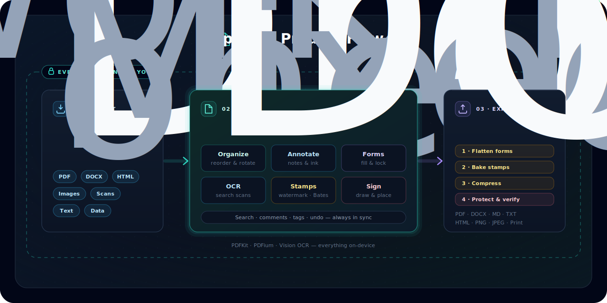
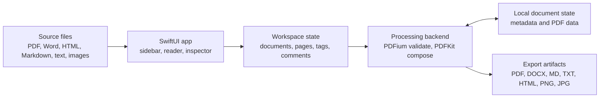
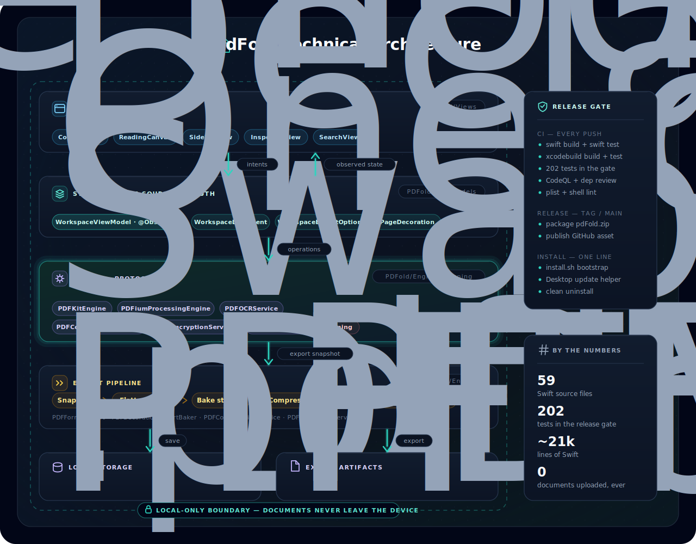

<br>

<p align="center">
  
</p>

<h1 align="center">PDFold</h1>

<p align="center">
  <em>A native macOS workspace for turning scattered documents into one organized PDF workflow.</em>
</p>

<p align="center">
  <strong>Import, arrange, annotate, sign, search, save, and export without sending your files anywhere.</strong>
</p>

<p align="center">
  
  &nbsp;&nbsp;
  
  &nbsp;&nbsp;
  
</p>

<p align="center">
  
  &nbsp;&nbsp;
  
  &nbsp;&nbsp;
  
</p>

<p align="center">
  
  &nbsp;&nbsp;
  
  &nbsp;&nbsp;
  
</p>

<p align="center">
  <a href="#simplest-local-setup">⚡&nbsp;<strong>Setup</strong></a>
  &nbsp;&nbsp;&nbsp;
  <a href="#what-it-does">✨&nbsp;<strong>Features</strong></a>
  &nbsp;&nbsp;&nbsp;
  <a href="#architecture">🏗️&nbsp;<strong>Architecture</strong></a>
  &nbsp;&nbsp;&nbsp;
  <a href="#release-status">🚢&nbsp;<strong>Release</strong></a>
  &nbsp;&nbsp;&nbsp;
  <a href="#quality-checks">✅&nbsp;<strong>Quality</strong></a>
  &nbsp;&nbsp;&nbsp;
  <a href="#troubleshooting">🧰&nbsp;<strong>Help</strong></a>
</p>

---

## Quick Start

Paste this into Terminal:

```zsh
curl -fsSL https://raw.githubusercontent.com/udhawan97/PDFold/main/install.sh | zsh
```

The installer downloads the latest prebuilt app, places it in `~/Applications/PDFold.app`, and adds Desktop commands for launching/updating and clean uninstall.

No Xcode. No GitHub account. No compile step. Just paste, install, and get back to the documents.

<details>
<summary>How to open Terminal</summary>

Open **Applications** -> **Utilities** -> **Terminal**, paste the command above, and press Return.
</details>

---

## The Short Version

PDFold is a local-first Mac app for the moment when "just send me the PDF" turns into six PDFs, two screenshots, a Word document, a form, and one file named `final_final_revised_ACTUAL.pdf`.

It gives those files a calm place to live. Drop in documents, combine them into one workspace, reorder pages, add notes and markup, place signatures, search the full set, save your project, and export the result in the format you need.

Everything happens on your Mac. No account, no upload queue, and no mystery cloud detour.

## At A Glance

|  | Signal | Why It Matters |
| --- | --- | --- |
| 🖥️ | Native macOS | Built with SwiftUI, PDFKit, document-based app architecture, and sandboxed file access |
| 📥 | Broad import support | Handles PDFs, Word documents, HTML, Markdown, text files, structured data, and images |
| 🧭 | Real workflow tools | Combine, reorder, rotate, delete, annotate, tag, comment, sign, search, save, print, and export |
| 🔒 | Local-first privacy | Files stay on the user's Mac instead of being uploaded to a service |
| ⚡ | Simple installation | One pasted command installs the prebuilt app and creates Desktop launch/update and uninstall commands |
| 🧱 | Release-minded engineering | Includes installer automation, crash hardening, import safety, export checks, and CI coverage |

## Who This Is For

|  | Audience | What to Notice |
| --- | --- | --- |
| 📎 | People with document chaos | Pull scattered files into one workspace, clean them up, and export something usable |
| 🧑‍💼 | Recruiters and hiring teams | A polished desktop product with clear user empathy, practical scope, and visible product judgment |
| 🧑‍💻 | Engineers | SwiftUI, PDFKit, PDFium-backed validation, file conversion, document persistence, undo-aware page operations, export pipelines, sandboxing, and installer automation |

## What It Does

|  | Capability | Details |
| --- | --- | --- |
| 📥 | Import | PDFs, Word docs, HTML, RTF, Markdown, plain text, CSV, JSON, XML, and common image formats |
| 🗂️ | Organize | Combine files, reorder source documents, move pages, rotate pages, delete pages, and keep navigation aligned |
| 📖 | Read | Native PDF canvas, generated section banners, table of contents, sidebar navigation, inspector views, and workspace search |
| ✍️ | Mark up | Highlight, note, editable text overlay, ink, underline, strikeout, and drawn signature placement |
| 🏷️ | Track | Workspace tags, workspace comments, document metadata, and an inspector list for reviewing annotations |
| 💾 | Save | Persistent `.pdfoldproj` workspaces with metadata, comments, tags, signatures, page order, and source PDF data |
| 📤 | Export | PDF, Word `.docx`, Markdown `.md`, plain text, HTML, PNG pages, JPEG pages, or print-ready output |
| 🔑 | Unlock | Password-protected PDF prompt using native PDFKit behavior |
| 🛡️ | Protect | Local-first design with sandboxed file access, local PDF validation, and no document upload pipeline |

## Product Flow

<p align="center">
  
</p>

<p align="center">
  <em>Bring in messy inputs, work with them as one local workspace, and export a clean result.</em>
</p>

## Architecture



<p align="center">
  
</p>

<p align="center">
  <em>SwiftUI handles the workspace experience, PDFKit powers document composition and annotation, and local persistence keeps projects editable.</em>
</p>

|  | Layer | Responsibility |
| --- | --- | --- |
| 🖥️ | SwiftUI app | Presents the document workspace, sidebar, reader, annotation tools, search, inspector, and export actions |
| ⚙️ | Document engine | Converts imports, validates PDFs through the processing backend, composes PDFs, manages page state, preserves annotations, and writes export formats |
| 💾 | Local storage | Saves workspace metadata, page order, source PDF data, comments, tags, signatures, and generated output |

## Why It Matters

Most PDF tools live at one of two extremes: too tiny to handle a real workflow, or so large that opening them feels like clocking in for a shift. PDFold aims for the useful middle.

It is built for document assembly as a workflow, not just PDF viewing as a feature. The goal is simple: take the pile, make sense of it, mark what matters, and send out one clean artifact.

For reviewers, the interesting part is not just that PDFold works. It is that the app ties together product thinking, native Mac engineering, file handling, persistence, export reliability, and distribution polish into one coherent project.

## Release Status

PDFold v3 is a release-hardened local-first macOS app for collecting scattered documents, turning them into one editable workspace, marking them up, tracking context, and exporting clean deliverables.

|  | Detail | Status |
| --- | --- | --- |
| 🚢 | Version | `3.0` |
| 🧾 | App metadata | `CFBundleShortVersionString` `3.0`, `CFBundleVersion` `3` |
| ⚡ | Install path | One-line installer downloads the latest prebuilt GitHub release |
| 🧪 | Smoke test | `./scripts/install-mac.sh --no-open` |
| 🔐 | Signing | Local ad-hoc signing for source and release packaging |
| 📦 | Distribution style | Prebuilt release zip, with source build fallback for developers |

### What Changed In v3

|  | Area | Release Update |
| --- | --- | --- |
| 🔄 | Automatic updates | The Desktop **PDFold.command** launcher checks the latest GitHub release every time it opens the app |
| 🧹 | Clean uninstall | The installer now creates **Uninstall PDFold.command** for removing the app, generated commands, installer cache, and PDFold app data |
| 🧪 | PDF processing backend | PDF imports pass through an injectable `PDFProcessingEngine`, with PDFium validation and a PDFKit fallback path |
| 🧭 | Simpler setup | The old separate update command is treated as a legacy artifact and cleaned up by install/update/uninstall scripts |
| 📝 | Release docs | README setup, update, uninstall, quality, and troubleshooting guidance now match the v3 install flow |

### Carried Forward From v2

|  | Area | Release Hardening |
| --- | --- | --- |
| 🏷️ | Workspace context | Tags and workspace comments persist with saved projects and appear in dedicated inspector tabs |
| ✍️ | Text editing | The text tool can create clean free-text boxes or convert selected PDF text into editable overlays |
| 📝 | Markdown export | Workspaces export `.md` files with a summary, comments, document sections, and extracted PDF text |
| 🖊️ | Ink stability | Ink annotations use PDFKit-native paths, with malformed legacy ink data sanitized before display |
| 🛡️ | Import safety | Import failures show actionable messages, oversized files are rejected early, and selected files use security-scoped access |
| 🔐 | Protected PDFs | Password-protected documents unlock from the already-loaded PDF instance for safer sandbox behavior |
| ↩️ | Undo reliability | Page deletion and reordering undo restore serialized PDF state, not just sidebar metadata |
| 🗂️ | Page order | Reordered pages rebuild the workspace page map so navigation, export, signatures, and saved projects stay aligned |
| 📤 | Export reliability | PDF and multi-format exports report write failures instead of failing quietly |
| 🧯 | Crash hardening | Reordering, page operations, PDF serialization, HTML rendering, image export, and signature storage guard failure cases |

## Simplest Local Setup

Paste one command into Terminal:

```zsh
curl -fsSL https://raw.githubusercontent.com/udhawan97/PDFold/main/install.sh | zsh
```

The installer downloads the latest prebuilt `PDFold.zip` from GitHub Releases, installs `PDFold.app` to `~/Applications`, creates self-updating launch and uninstall Desktop commands, removes download quarantine metadata, and opens the app.

The normal path does not require Xcode, Apple's Command Line Tools, a package manager, or a GitHub account. The installer is intentionally uneventful, which is exactly how installers should behave.

Important release note: the zero-compile installer depends on a published GitHub release containing `PDFold.zip`. If no prebuilt release is available, the installer falls back to a source build and macOS may ask for Apple's free Command Line Tools.

<details>
<summary>Developer source install</summary>

```zsh
git clone https://github.com/udhawan97/PDFold.git
cd PDFold
./scripts/install-mac.sh
```
</details>

## Updating The App

Double-click **PDFold.command** on the Desktop. The launcher checks for the latest release, refreshes the installed app when needed, and then opens PDFold.

You can also paste the installer command again:

```zsh
curl -fsSL https://raw.githubusercontent.com/udhawan97/PDFold/main/install.sh | zsh
```

If PDFold is already installed, the updater closes the running app if needed, replaces `~/Applications/PDFold.app`, refreshes the Desktop launcher, removes quarantine metadata, and opens the updated app.

## Uninstalling The App

Double-click **Uninstall PDFold.command** on the Desktop to remove the installed app, generated Desktop commands, installer cache, and PDFold app data.

Saved `.pdfoldproj` workspace files are not removed. To keep app support, preferences, caches, and sandbox data too, run:

```zsh
curl -fsSL https://raw.githubusercontent.com/udhawan97/PDFold/main/scripts/uninstall-mac.sh | zsh -s -- --keep-user-data
```

<details>
<summary>Developer source update</summary>

```zsh
git pull
./scripts/install-mac.sh
```

Useful terminal options:

```zsh
./scripts/install-mac.sh --clean
./scripts/install-mac.sh --no-open
./scripts/install-mac.sh --help
```

The local script can install a release build, package a release zip, or build from the current source checkout.
</details>

## Requirements

|  | Requirement | Version |
| --- | --- | --- |
| 🍎 | macOS | 14 Sonoma or newer |
| 📦 | Normal install | Published `PDFold.zip` release |
| 🧰 | Source build fallback | Apple Command Line Tools with Swift 5.9+ |

<details>
<summary>Why might Command Line Tools appear?</summary>

The normal installer downloads a prebuilt `.app`. If no release artifact is available, PDFold falls back to a source build with SwiftPM, which requires Apple's free Command Line Tools. Full Xcode is not required.
</details>

## Daily Workflow

1. Launch PDFold.
2. Drag in PDFs, Word documents, text files, web exports, data files, or images.
3. Reorder documents and pages until the workspace matches the story you need to tell.
4. Highlight, annotate, add notes, tag the workspace, capture comments, or place a drawn signature.
5. Search across the combined document set when the one detail you need is hiding on page 37.
6. Save the workspace if you want to keep editing later.
7. Export a PDF, Word document, Markdown file, text file, HTML file, or page images.

## Technical Layout

```text
PDFold/
  App/             App entry point and command wiring
  Document/        macOS document package read/write support
  Engine/          PDF loading, conversion, composition, manifests, export helpers
  Models/          Workspace, page, annotation, comment, and signature data models
  Resources/       App metadata, entitlements, and asset catalogs
  ViewModels/      Workspace state, document operations, search, export, undo
  Views/           SwiftUI interface components
scripts/
  install-mac.command  Compatibility double-click installer
  install-mac.sh       Release-first installer, source builder, and release packager
  uninstall-mac.sh     Clean uninstaller for installed app artifacts and PDFold app data
install.sh
  Hosted one-line bootstrap
Install or Update PDFold.app
  Finder installer/updater that bypasses Terminal shell startup
Install or Update PDFold.command
  Compatibility Terminal installer/updater
Uninstall PDFold.command
  Compatibility Terminal uninstaller
```

## Developer Notes

Open the project in Xcode:

```zsh
open PDFold.xcodeproj
```

Build with SwiftPM:

```zsh
swift build
```

Create the same release zip used by GitHub Releases:

```zsh
./scripts/install-mac.sh --package-only --package /tmp/PDFold.zip
```

Install from the current source checkout without opening the app:

```zsh
./scripts/install-mac.sh --no-open
```

## Privacy & Security

PDFold is local-first by design. Documents are opened, edited, saved, and exported on your machine.

The app uses macOS sandboxing and file access through user-selected documents. Its new PDF processing backend runs locally for import validation; it is not a remote upload service. In plain English: PDFold works with the files you hand it, not your entire digital attic.

Release v3 also includes practical guardrails around failure-prone paths:

- A supplemental PDFium processing backend performs a non-blocking validation smoke check before PDFKit proceeds with the normal import path.
- Files larger than 512 MB are rejected before loading to avoid memory pressure from accidental giant imports.
- PDF serialization failures preserve existing package data or report an actionable import error instead of writing broken workspace state.
- Malformed legacy ink annotations are rebuilt before display so PDFKit does not crash while drawing them.
- Markdown exports include workspace metadata, comments, document headings, and extracted document text.
- HTML rendering, image export, page operations, and signature storage guard invalid or unavailable state.
- Export failures are surfaced to the user, including failed writes and image-rendering errors.

<details>
<summary>Sandbox details</summary>

The app enables:

- `com.apple.security.app-sandbox`
- `com.apple.security.files.user-selected.read-write`

These entitlements allow sandboxed read/write access to files selected by the user.
</details>

## Quality Checks

Before shipping a build, verify both the developer path and the human-with-documents path.

|  | Check | What To Verify |
| --- | --- | --- |
| ✅ | Build | `swift build` completes |
| 🧪 | Installer smoke test | `./scripts/install-mac.sh --no-open` installs the release or builds, signs, installs, and refreshes Desktop commands |
| 📦 | Release package | `./scripts/install-mac.sh --package-only --package /tmp/PDFold.zip` creates the release artifact |
| 📥 | Import | Drag-and-drop works with supported file types |
| 🧪 | Processing backend | PDFium validation runs when available, and PDFKit fallback remains usable |
| 🔑 | Protected PDFs | Password-protected PDFs show the unlock flow |
| 💾 | Persistence | Saved workspaces reopen with metadata, markup, comments, signatures, and document data intact |
| 🔎 | Search | Search results navigate across the combined workspace |
| 🏷️ | Inspector | Tags, comments, info, and markup tabs reflect workspace state |
| ✍️ | Annotation | Highlight, note, editable text, ink, underline, strikeout, and undo behavior work |
| 🗂️ | Pages | Page rotation, deletion, and reordering stay aligned with navigation and export |
| 📤 | Export | PDF, Word, Markdown, text, HTML, PNG, and JPEG exports complete successfully |
| 🚀 | Launch/update | Desktop launcher updates and opens the installed app |
| 🧹 | Uninstall | `./scripts/uninstall-mac.sh --help` prints usage and the Desktop uninstaller removes install artifacts |

For v3 release preparation, the local verification pass should include:

```zsh
plutil -lint PDFold/Resources/Info.plist
plutil -lint PDFold/Resources/PDFold.entitlements
zsh -n install.sh
zsh -n scripts/install-mac.sh
zsh -n scripts/uninstall-mac.sh
zsh -n scripts/install-mac.command
zsh -n "Install or Update PDFold.command"
zsh -n "Uninstall PDFold.command"
plutil -lint "Install or Update PDFold.app/Contents/Info.plist"
swift build
./scripts/install-mac.sh --package-only --package /tmp/PDFold.zip
```

## Roadmap

- Richer signature management.
- More export presets.
- Improved document thumbnails and faster page navigation.
- Automated UI smoke tests.
- Developer ID signing and notarized release builds for the smoothest possible macOS install path.

## Contributing

Contributions are welcome when they keep the product focused and the workflow calm.

1. Create a focused branch.
2. Keep changes scoped.
3. Run the local verification checks.
4. Include screenshots or notes for UI changes.
5. Open a pull request with the problem, approach, and verification steps.

## Troubleshooting

<details>
<summary>Clicking the installer opens a GitHub page instead of installing</summary>

That is expected on GitHub. README links open files in the browser; they do not execute Mac installer scripts.

Use the Quick Start command from Terminal, or download the repository first and run the installer from Finder.
</details>

<details>
<summary>Double-clicking the installer says it cannot be opened</summary>

Open Terminal in the project folder and run:

```zsh
chmod +x "Install or Update PDFold.command" "Uninstall PDFold.command" "Install or Update PDFold.app/Contents/MacOS/PDFoldInstaller" scripts/install-mac.sh scripts/install-mac.command scripts/uninstall-mac.sh
```

Then double-click `Install or Update PDFold.app` again from Finder.
</details>

<details>
<summary>The installer says Command Line Tools are needed</summary>

The normal installer uses a prebuilt app and does not need developer tools. This message means a prebuilt release was not available, so the installer fell back to a source build.

Install Apple's free Command Line Tools from the macOS prompt, then run the installer again. Full Xcode is not required.
</details>

<details>
<summary>The Desktop launcher does not open the app</summary>

Run the installer again. It refreshes `~/Applications/PDFold.app` and recreates the Desktop launcher.
</details>

<details>
<summary>macOS warns the app is from an unidentified developer</summary>

PDFold release builds are ad-hoc signed but not notarized. The installer removes download quarantine from the installed app. If macOS still warns, open it from Finder, then use **Open** from the security prompt.

Fully silent Gatekeeper behavior requires Apple Developer ID signing and notarization, which is listed on the roadmap.
</details>

<details>
<summary>The app did not update</summary>

Double-click **PDFold.command** on the Desktop, or paste the Quick Start command again.

For a fully fresh developer source build:

```zsh
./scripts/install-mac.sh --clean
```
</details>

<details>
<summary>The build fails and the terminal window closes too fast</summary>

Open `.build/install.log` in the project folder. It contains the latest installer/build output.

You can also run the installer from Terminal to keep the output visible:

```zsh
./scripts/install-mac.sh
```
</details>

## License

PDFold is available under the [MIT License](LICENSE).
