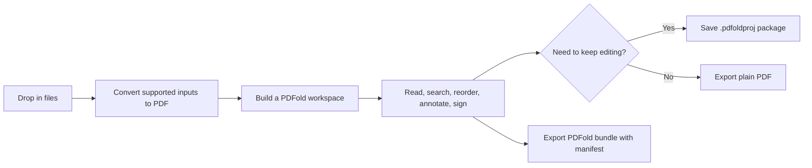
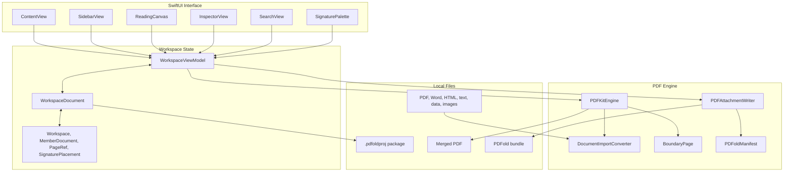

<p align="center">
  
</p>

<h1 align="center">PDFold</h1>

<p align="center">
  <strong>A native macOS document workspace for turning a pile of files into one civilized PDF workflow.</strong>
</p>

<p align="center">
  
  
  
  
  
</p>

---

## The Short Version

> Personal pain point, professionally over-engineered into a native Mac app.

PDFold is a local-first Mac app for importing PDFs, Word documents, HTML, Markdown, text, CSV/JSON/XML files, and images, then reading, organizing, annotating, signing, searching, saving, printing, and exporting them as one coherent PDF workspace.

I built it to solve my own very real, very annoying problem: documents do not arrive as one neat file. They arrive as "final.pdf", "final-final.pdf", "signature-page-use-this-one.pdf", a screenshot, a Word doc, and the kind of attachment naming strategy that makes a person stare quietly out a window.

PDFold folds the mess into a usable workspace. Hence the name. I regret nothing.

## At A Glance

| Signal | Why It Matters |
| --- | --- |
| 🖥️ Native macOS | SwiftUI, PDFKit, document-based app architecture, sandboxed file access |
| 🔒 Local-first | No accounts, no upload pipeline, no "where did my documents go?" subplot |
| 🧭 Real workflow | Import, combine, annotate, search, sign, save, print, export |
| 🛠️ Simple setup | Double-click one file to install, then run that same file again to update |
| 🧑‍💼 Portfolio-ready | Clear product problem, practical engineering, user-facing polish |

## Who This Is For

| Audience | What to Notice |
| --- | --- |
| Recruiters | A polished native macOS app with a clear user problem, visible product thinking, and practical engineering choices. |
| Developers | SwiftUI, PDFKit, document packages, custom import conversion, manifest-based bundle export, undo-aware page operations, and installer automation. |
| Actual humans with PDFs | Drag files in, make sense of them, sign what needs signing, export one clean document, and move on with your day. |

## What It Does

| Capability | Details |
| --- | --- |
| 📥 Import | PDFs, Word docs, HTML, RTF, Markdown, plain text, CSV, JSON, XML, and images |
| 🗂️ Organize | Combine files, reorder source documents, move pages within documents, rotate pages, and delete pages |
| 📖 Read | Native PDF canvas, generated section banners, table of contents, sidebar navigation, and search |
| ✍️ Mark up | Highlight, note, ink, underline, strikeout, and signature tools |
| 💾 Save | Editable `.pdfoldproj` document packages with workspace metadata and source PDF data |
| 📤 Export | Plain merged PDF, printable workspace, or `.pdfold` bundle with embedded manifest data |
| 🔑 Unlock | Password-protected PDF prompt using native PDFKit behavior |
| 🛡️ Protect | Local-first by design; your files stay on your Mac |

## Product Flow



## Architecture



## Why It Matters

Most PDF tools either feel like a full-time job or only solve one tiny part of the workflow. PDFold aims for the middle: focused enough to be fast, native enough to feel at home on macOS, and practical enough to handle the document chaos that shows up in real life.

The app is intentionally local-first. No account. No upload step. No mysterious cloud conveyor belt. Just your Mac, your files, and a small amount of hard-earned order.

## Simplest Local Setup

The entire local install path is designed to be one double-click:

1. Double-click [`Install or Update PDFold.command`](Install%20or%20Update%20PDFold.command).
2. Let it build PDFold locally.
3. Use the `PDFold` Desktop launcher it creates.

That is it. The installer puts the app in `~/Applications/PDFold.app`, refreshes a Desktop launcher named `PDFold`, signs the local build ad-hoc, opens the app, and writes a setup log to `.build/install.log`.

No admin password, no global package manager, no "please install five unrelated things because a PDF app sneezed" detour.

## Updating The App

To update PDFold locally:

1. Pull or download the latest project code.
2. Double-click [`Install or Update PDFold.command`](Install%20or%20Update%20PDFold.command) again.

The installer is intentionally repeatable. If PDFold is already installed, it rebuilds the latest code, closes the running app if needed, replaces `~/Applications/PDFold.app`, refreshes the Desktop launcher, and opens the updated app.

<details>
<summary>Prefer Terminal?</summary>

```zsh
./scripts/install-mac.sh
```

Useful terminal options:

```zsh
./scripts/install-mac.sh --clean
./scripts/install-mac.sh --no-open
./scripts/install-mac.sh --help
```

The terminal script performs the same install/update flow as the double-click version.
</details>

## Requirements

| Requirement | Version |
| --- | --- |
| macOS | 14 Sonoma or newer |
| Xcode | 15 or newer |
| Swift | 5.9 |

<details>
<summary>Why Xcode?</summary>

PDFold is a native SwiftUI document app. The setup script uses `xcodebuild` to produce a real `.app` bundle, copy it into your user Applications folder, apply a local ad-hoc signature, and create a Desktop launcher that behaves like a normal Mac app.
</details>

## Daily Workflow

1. Launch PDFold.
2. Drag in one or more files.
3. Read, reorder, annotate, search, sign, rotate, or remove pages.
4. Save a `.pdfoldproj` workspace if you want to keep editing later.
5. Export a merged PDF when you need one clean file for someone who has not yet joined your beautifully organized future.

## Technical Layout

```text
PDFold/
  App/             App entry point and command wiring
  Document/        macOS document package read/write support
  Engine/          PDF loading, conversion, concatenation, manifests, export helpers
  Models/          Workspace, page, annotation, and signature data models
  Resources/       App metadata, entitlements, and asset catalogs
  ViewModels/      Workspace state, document operations, search, export, undo
  Views/           SwiftUI interface components
scripts/
  install-mac.command  Compatibility double-click installer
  install-mac.sh       Terminal installer
Install or Update PDFold.command
  Root-level double-click installer/updater
```

## Developer Notes

Open the project in Xcode:

```zsh
open PDFold.xcodeproj
```

Build from the command line:

```zsh
xcodebuild -project PDFold.xcodeproj -scheme PDFold -configuration Debug build
```

Run the same release build path used by the installer:

```zsh
xcodebuild \
  -project PDFold.xcodeproj \
  -scheme PDFold \
  -configuration Release \
  -derivedDataPath .build/xcode \
  CODE_SIGNING_ALLOWED=NO \
  build
```

Or use the installer in no-open mode:

```zsh
./scripts/install-mac.sh --no-open
```

## Privacy & Security

PDFold is a local-first Mac app. Documents are opened, edited, saved, and exported on your machine.

The app uses macOS sandboxing and file access through user-selected documents. In normal-person English: it handles the files you give it, not your entire digital attic.

<details>
<summary>Sandbox details</summary>

The app enables:

- `com.apple.security.app-sandbox`
- `com.apple.security.files.user-selected.read-write`

These entitlements allow sandboxed read/write access to files selected by the user.
</details>

## Testing Checklist

Before shipping a build, verify:

- Drag-and-drop import with multiple supported file types.
- Password-protected PDF unlock flow.
- Save and reopen of `.pdfoldproj` packages.
- Search results across combined documents.
- Annotation tools and undo behavior.
- Page rotation, deletion, and reordering.
- Plain PDF export.
- PDFold bundle export.
- Desktop launcher opens the installed app after running the Mac installer.

## Roadmap

- Richer signature management.
- More export presets.
- Improved document thumbnails and faster page navigation.
- Automated UI smoke tests.
- Notarized release builds for easier distribution.

## Contributing

Good contributions are focused, tested, and kind to the next person reading the code at 11:47 PM.

1. Create a focused branch.
2. Keep changes scoped.
3. Run a local build.
4. Include screenshots or notes for UI changes.
5. Open a pull request with the problem, approach, and verification steps.

## Troubleshooting

<details>
<summary>Double-clicking the installer says it cannot be opened</summary>

Open Terminal in the project folder and run:

```zsh
chmod +x "Install or Update PDFold.command" scripts/install-mac.sh scripts/install-mac.command
```

Then double-click [`Install or Update PDFold.command`](Install%20or%20Update%20PDFold.command) again.
</details>

<details>
<summary>The installer says Xcode is missing or not ready</summary>

Install Xcode from the Mac App Store, then open it once so macOS can finish setup. After that, run the installer again.

If Xcode is installed but still not ready, run:

```zsh
xcodebuild -version
```

macOS may ask you to accept the Xcode license or finish installing command line tools.
</details>

<details>
<summary>The Desktop launcher does not open the app</summary>

Run [`Install or Update PDFold.command`](Install%20or%20Update%20PDFold.command) again. It refreshes `~/Applications/PDFold.app` and recreates the Desktop launcher.
</details>

<details>
<summary>macOS warns the app is from an unidentified developer</summary>

This local development build is not notarized. Open it from Finder, then use **Open** from the security prompt. For distributed releases, sign and notarize the app with an Apple Developer account.
</details>

<details>
<summary>The app did not update</summary>

Make sure you pulled or downloaded the latest project code first, then run the installer again.

For a fully fresh local build:

```zsh
./scripts/install-mac.sh --clean
```
</details>

<details>
<summary>The build fails and the terminal window closes too fast</summary>

Open `.build/install.log` in the project folder. It contains the latest installer/build output.

You can also run the installer from Terminal to keep the output visible:

```zsh
./scripts/install-mac.sh
```
</details>

## License

PDFold is available under the [MIT License](LICENSE).
