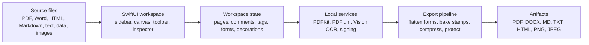

<br>

<p align="center">
  
</p>

<h1 align="center">pdFold</h1>

<p align="center">
  <em>A native, local-first macOS workspace for assembling, editing, protecting, and exporting PDFs.</em>
</p>

<p align="center">
  <strong>Import scattered files, clean up the document, add markup or signatures, handle forms and scans, then export a polished PDF without uploading your work.</strong>
</p>

<p align="center">
  
  &nbsp;&nbsp;
  
  &nbsp;&nbsp;
  
</p>

<p align="center">
  
  &nbsp;&nbsp;
  
  &nbsp;&nbsp;
  
</p>

<p align="center">
  
  &nbsp;&nbsp;
  
</p>

<p align="center">
  <a href="#quick-start"><strong>Quick Start</strong></a>
  &nbsp;&nbsp;&nbsp;
  <a href="#features"><strong>Features</strong></a>
  &nbsp;&nbsp;&nbsp;
  <a href="#product-flow"><strong>Product Flow</strong></a>
  &nbsp;&nbsp;&nbsp;
  <a href="#architecture"><strong>Architecture</strong></a>
  &nbsp;&nbsp;&nbsp;
  <a href="#release-status"><strong>Release</strong></a>
  &nbsp;&nbsp;&nbsp;
  <a href="#developer-notes"><strong>Developers</strong></a>
</p>

---

## Quick Start

Paste this into Terminal:

```zsh
curl -fsSL https://raw.githubusercontent.com/udhawan97/PDFold/main/install.sh | zsh
```

The installer downloads the latest prebuilt app, places it in `~/Applications/pdFold.app`, and creates Desktop commands for launch/update and uninstall.

Direct download: [`pdFold.zip`](https://github.com/udhawan97/PDFold/releases/latest/download/pdFold.zip)

No Xcode. No GitHub account. No compile step.

<details>
<summary>Homebrew install</summary>

```zsh
brew tap udhawan97/pdfold https://github.com/udhawan97/PDFold
brew install --cask udhawan97/pdfold/pdfold
```

Homebrew installs the same prebuilt app. The one-line installer remains the friendliest path because it also creates Desktop launch/update and uninstall commands.
</details>

<details>
<summary>How to open Terminal</summary>

Open **Applications** -> **Utilities** -> **Terminal**, paste the command above, and press Return.
</details>

## What pdFold Is

pdFold is for the moment when a simple PDF task becomes six PDFs, two screenshots, a Word document, a scanned form, and one file named `final_final_revised_ACTUAL.pdf`.

It gives that pile a single local workspace. You can import files, reorder pages, annotate, edit detected text, fill and lock forms, add stamps, make scans searchable, compress the output, protect it with a password, and export the result.

Everything happens on your Mac.

## Features

| Area | What you can do | Built for |
| --- | --- | --- |
| Import | Open PDFs, Word documents, HTML, Markdown, text, CSV, JSON, XML, and common image formats | Turning mixed inputs into one workspace |
| Organize | Reorder documents and pages, rotate pages, delete pages, use section banners, and navigate from the sidebar | Assembling a clean packet from messy source files |
| Read and search | Use a native PDF canvas, page indicator, sidebar navigation, inspector, workspace search, and password unlock prompts | Finding the right page without losing context |
| Annotate | Highlight, add notes, draw ink, underline, strike out, place text boxes, and edit detected PDF text | Reviewing and correcting documents in place |
| Comments and metadata | Add workspace comments, tags, document details, and inspector-visible annotation lists | Keeping review context attached to the file |
| Signatures | Draw and place signatures, then export signed PDF output locally | Handling lightweight signature workflows without leaving the app |
| Forms | Detect PDF form fields, edit answers, reset forms, and lock answers during export | Finishing forms before sending the final copy |
| Scans and OCR | Make scanned pages searchable with local Vision OCR and preserve recognized text in export | Making image-only PDFs searchable without a cloud service |
| Stamps and decorations | Add watermarks, page numbers, Bates labels, and movable stamps that burn into exported PDFs | Preparing packets, exhibits, and reviewed drafts |
| Compression | Downsample oversized PDF images and validate the compressed result | Sending smaller files while protecting text integrity |
| Protection | Export password-protected PDFs with permission checks and post-export verification | Sharing sensitive documents more deliberately |
| Export | Save normal PDFs or export PDF, DOCX, Markdown, plain text, HTML, PNG pages, JPEG pages, or print output | Sending the format the next person actually needs |
| Install and update | Install with one command, use Desktop launch/update helpers, uninstall cleanly, or install through Homebrew | Making the app usable by people who do not build software |

## Product Flow

<p align="center">
  
</p>

<p align="center">
  <em>Bring in mixed files, work locally, then export a clean, searchable, protected, or smaller result.</em>
</p>

## Architecture



<p align="center">
  
</p>

| Layer | Responsibility |
| --- | --- |
| SwiftUI app | Document window, sidebar, canvas, annotation toolbar, search, inspector, password prompts, and export controls |
| Workspace state | Imported documents, page order, undo snapshots, comments, tags, signatures, form summaries, and decorations |
| PDF services | PDFKit composition, PDFium validation and compression support, Vision OCR, encryption, form flattening, decoration baking, and signing helpers |
| Local storage | Saved PDF data, workspace metadata, source payloads, comments, signatures, and page edit state |
| Release tooling | One-line installer, package builder, Desktop update launcher, uninstaller, GitHub Actions release asset, and validation tests |

## Release Status

pdFold v6 is the current release candidate. It expands the app from document assembly and markup into a fuller PDF finishing workflow: searchable scans, form export, stamps/decorations, compression, protected output, and a cleaner everyday UI.

| Detail | Status |
| --- | --- |
| Release tag | [`release-v6`](https://github.com/udhawan97/PDFold/releases/tag/release-v6) |
| Release asset | [`pdFold.zip`](https://github.com/udhawan97/PDFold/releases/latest/download/pdFold.zip) |
| App metadata | `CFBundleShortVersionString` `v6`, `CFBundleVersion` `6` |
| Recommended install | `curl -fsSL https://raw.githubusercontent.com/udhawan97/PDFold/main/install.sh \| zsh` |
| Distribution | Prebuilt macOS app zip, with source builds available for developers |
| Privacy model | Local document processing; no upload pipeline |

## Updating

Double-click **pdFold.command** on the Desktop. The launcher checks the latest release before opening the app.

You can also paste the installer command again:

```zsh
curl -fsSL https://raw.githubusercontent.com/udhawan97/PDFold/main/install.sh | zsh
```

Homebrew users can run:

```zsh
brew update
brew upgrade --cask udhawan97/pdfold/pdfold
```

## Uninstalling

Double-click **Uninstall pdFold.command** on the Desktop to remove the installed app, generated Desktop commands, installer cache, and pdFold app data.

To keep app support, preferences, caches, and sandbox data:

```zsh
curl -fsSL https://raw.githubusercontent.com/udhawan97/PDFold/main/scripts/uninstall-mac.sh | zsh -s -- --keep-user-data
```

Homebrew users can run:

```zsh
brew uninstall --cask udhawan97/pdfold/pdfold
```

## Requirements

| Requirement | Version |
| --- | --- |
| macOS | 14 Sonoma or newer |
| Normal install | Published `pdFold.zip` release asset |
| Developer source build | Apple Command Line Tools with Swift 5.9+ |

<details>
<summary>Why might Command Line Tools appear?</summary>

The normal installer downloads a prebuilt `.app` and does not need Command Line Tools. They only appear when building from source.
</details>

## Daily Workflow

1. Launch pdFold.
2. Drag in PDFs, Word documents, text files, web exports, data files, scans, or images.
3. Reorder documents and pages until the workspace matches the story you need to tell.
4. Annotate, edit text, fill forms, add comments, add stamps, or place a signature.
5. Search across the combined document set.
6. Make scans searchable, compress the PDF, or protect the output when needed.
7. Save a normal PDF or export another format.

## Privacy And Security

pdFold is local-first by design. Documents are opened, edited, saved, OCRed, compressed, protected, and exported on your machine.

The app uses macOS sandboxing and user-selected file access. PDFium validation, Vision OCR, PDFKit composition, compression, encryption, and export verification run locally.

Practical guardrails include:

- Password prompts for protected PDFs.
- Import size limits for accidental giant files.
- Local validation before and after compression or encryption.
- Form flattening before decoration burn-in when requested.
- Export error reporting for failed writes, image rendering, malformed PDFs, or unsafe source round trips.
- Hidden pdFold comment metadata stripped before flat PDF export.
- Installer, uninstaller, packaging, build, and test checks in the release gate.

<details>
<summary>Sandbox details</summary>

The app enables:

- `com.apple.security.app-sandbox`
- `com.apple.security.files.user-selected.read-write`

These entitlements allow sandboxed read/write access to files selected by the user.
</details>

## Developer Notes

```text
PDFold/
  App/             App entry point and command wiring
  Document/        macOS document package read/write support
  Engine/          PDF loading, conversion, OCR, compression, encryption, forms, export helpers
  Models/          Workspace, page, annotation, comment, export option, and decoration models
  Resources/       App metadata, entitlements, assets, and certificate guide
  Signing/         Signing identities, CMS construction, timestamping, and verification helpers
  ViewModels/      Workspace state, document operations, search, export, undo
  Views/           SwiftUI interface components
scripts/
  install-mac.sh       Release-first installer, source builder, and release packager
  uninstall-mac.sh     Clean uninstaller for installed app artifacts and pdFold app data
install.sh             Hosted one-line bootstrap
```

<details>
<summary>Build, test, package, and source-install commands</summary>

Open the project in Xcode:

```zsh
open PDFold.xcodeproj
```

Build and test:

```zsh
swift build
swift test
xcodebuild build -quiet -project PDFold.xcodeproj -scheme PDFold -destination 'generic/platform=macOS' CODE_SIGNING_ALLOWED=NO
xcodebuild test -quiet -project PDFold.xcodeproj -scheme PDFold -destination 'platform=macOS' CODE_SIGNING_ALLOWED=NO
```

Create the same release zip used by GitHub Releases:

```zsh
./scripts/install-mac.sh --package-only --package /tmp/pdFold.zip
```

Install from the current source checkout without opening the app:

```zsh
./scripts/install-mac.sh --no-open
```
</details>

## Quality Checks

| Check | What to verify |
| --- | --- |
| Build | `swift build` completes |
| Tests | `swift test` and Xcode tests pass |
| Metadata | App plists and entitlements lint cleanly |
| Installer | Shell scripts parse with `zsh -n` |
| Package | `./scripts/install-mac.sh --package-only --package /tmp/pdFold.zip` creates the release artifact |
| User workflow | Import, search, annotate, forms, OCR, stamps, compression, protected export, update, and uninstall work on a local Mac |

<details>
<summary>Release gate commands</summary>

```zsh
plutil -lint PDFold/Resources/Info.plist
plutil -lint PDFold/Resources/PDFold.entitlements
zsh -n install.sh
zsh -n scripts/install-mac.sh
zsh -n scripts/uninstall-mac.sh
zsh -n scripts/install-mac.command
zsh -n "Install or Update pdFold.command"
zsh -n "Uninstall pdFold.command"
zsh -n "Install or Update pdFold.app/Contents/MacOS/pdFoldInstaller"
plutil -lint "Install or Update pdFold.app/Contents/Info.plist"
swift build
swift test
xcodebuild build -quiet -project PDFold.xcodeproj -scheme PDFold -destination 'generic/platform=macOS' CODE_SIGNING_ALLOWED=NO
xcodebuild test -quiet -project PDFold.xcodeproj -scheme PDFold -destination 'platform=macOS' CODE_SIGNING_ALLOWED=NO
./scripts/install-mac.sh --package-only --package /tmp/pdFold.zip
```
</details>

## Roadmap

- Developer ID signing and notarized release builds for the smoothest macOS install path.
- More export presets.
- Faster large-document navigation.
- Automated UI smoke tests.

## Troubleshooting

<details>
<summary>Clicking the installer opens a GitHub page instead of installing</summary>

That is expected on GitHub. README links open files in the browser; they do not execute Mac installer scripts.

Use the Quick Start command from Terminal, or download the repository first and run the installer from Finder.
</details>

<details>
<summary>Double-clicking the installer says it cannot be opened</summary>

Open Terminal in the project folder and run:

```zsh
chmod +x "Install or Update pdFold.command" "Uninstall pdFold.command" "Install or Update pdFold.app/Contents/MacOS/pdFoldInstaller" scripts/install-mac.sh scripts/install-mac.command scripts/uninstall-mac.sh
```

Then double-click `Install or Update pdFold.app` again from Finder.
</details>

<details>
<summary>The installer says no prebuilt release is available</summary>

The normal installer uses a prebuilt app and does not need developer tools. This message means the GitHub release asset `pdFold.zip` has not been published yet or could not be downloaded.

Wait for the release workflow to publish `pdFold.zip`, then run the installer again. Developer source builds can opt in with:

```zsh
curl -fsSL https://raw.githubusercontent.com/udhawan97/PDFold/main/install.sh | PDFOLD_ALLOW_SOURCE_BUILD=1 zsh
```
</details>

<details>
<summary>macOS warns the app is from an unidentified developer</summary>

pdFold release builds are ad-hoc signed but not notarized. The installer removes download quarantine from the installed app. If macOS still warns, open it from Finder, then use **Open** from the security prompt.

Fully quiet Gatekeeper behavior requires Apple Developer ID signing and notarization, which is on the roadmap.
</details>

<details>
<summary>The build fails and the terminal window closes too fast</summary>

Open `.build/install.log` in the project folder. It contains the latest installer/build output.

When using the README install command, the prebuilt release attempt is also logged at `~/.pdfold/prebuilt-install.log`.
</details>

## License

pdFold is available under the [MIT License](LICENSE).
