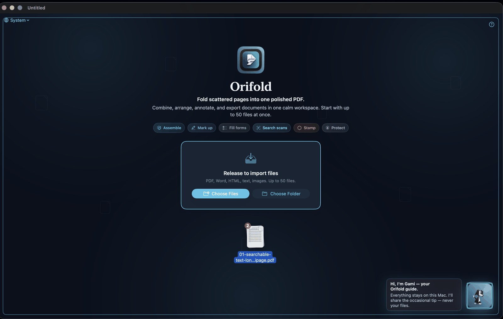

<p align="center">
  
</p>

<h1 align="center">Orifold</h1>

<p align="center"><em>One sheet, folded into flight.</em></p>

<p align="center">
  A calm, local-first PDF workspace for macOS. Drop in up to 50 messy files —<br>
  merge, edit, OCR, sign, compress, and protect them — and fold the whole pile<br>
  into one clean, searchable, password-protected document. Nothing leaves your Mac.
</p>

<p align="center">
  <strong>No account</strong>&nbsp;&nbsp;·&nbsp;&nbsp;<strong>No upload</strong>&nbsp;&nbsp;·&nbsp;&nbsp;<strong>No subscription</strong>
</p>

<p align="center">
  <sub>折&nbsp;&nbsp;the fold&nbsp;&nbsp;·&nbsp;&nbsp;鶴&nbsp;&nbsp;the crane&nbsp;&nbsp;·&nbsp;&nbsp;間&nbsp;&nbsp;ma, the margin&nbsp;&nbsp;·&nbsp;&nbsp;朱&nbsp;&nbsp;the seal</sub>
</p>

<p align="center">
  
  
  
  
  
  
  
</p>

<p align="center">
  <a href="#install"><kbd>&nbsp;⚡&nbsp;Install&nbsp;</kbd></a>&nbsp;
  <a href="#what-it-does"><kbd>&nbsp;✨&nbsp;Features&nbsp;</kbd></a>&nbsp;
  <a href="#your-paper-companion"><kbd>&nbsp;🐾&nbsp;Companion&nbsp;</kbd></a>&nbsp;
  <a href="#privacy"><kbd>&nbsp;🔒&nbsp;Privacy&nbsp;</kbd></a>&nbsp;
  <a href="#under-the-hood"><kbd>&nbsp;⚙️&nbsp;Under&nbsp;the&nbsp;hood&nbsp;</kbd></a>&nbsp;
  <a href="https://udhawan97.github.io/Orifold/"><kbd>&nbsp;📖&nbsp;Docs&nbsp;</kbd></a>
</p>

<p align="center">
  <sub>The workspace — sidebar, canvas, markup toolbar, and your paper companion, all on your Mac.</sub>
</p>

> [!NOTE]
> Orifold is a **work-in-progress beta**, built in the open. Everyday PDF work — merge,
> annotate, OCR, sign, protect, export — is solid and gated by 800+ tests. Object editing
> landed in v0.8.8 and is still hardening; a few folds (real redaction, side-by-side compare)
> are yet to come. [Feedback welcome](https://github.com/udhawan97/Orifold/issues).

## The fold

A "simple PDF task" is rarely one file. It's six PDFs, two screenshots, a Word document, a
scan, and one determined file named `final_final_revised_ACTUAL.pdf`. The everyday tools rent
your own files back to you: Preview stops short of the hard parts, and the capable apps hide
them behind a subscription and an upload.

Orifold is the workspace that was missing — **native, local, and free**. Drag the whole pile
in; it repairs broken files on the way, stacks them into one calm workspace, and folds them
into a single clean document. The cloud is never consulted.

<p align="center">
  <picture>
    <source media="(prefers-color-scheme: dark)" srcset="docs/assets/hero-banner-dark.svg">
    
  </picture>
</p>

## What it does

Everything below runs on your Mac. The cloud was not consulted.

| | Do this | Get this |
| :---: | --- | --- |
| 📥 | **Import anything** — PDFs, Word, images, scans, Markdown, HTML, CSV — even corrupt files | One workspace instead of a folder of chaos; broken PDFs repaired on the way in |
| 🗂️ | **Organize** — reorder, rotate, delete pages across documents | A clean packet from messy source files |
| ✏️ | **Annotate & edit** — highlight, notes, ink, text boxes, edit real PDF text in place | Reviewed documents without a print-sign-scan loop |
| 🧩 | **Edit objects** *(beta)* — the **Select** tool clicks a real graphic on the page, then moves, resizes, or deletes it | Fix the layout itself, not just a note stuck on top of it |
| 🖋️ | **Sign & fill forms** — draw signatures or place a real PAdES digital signature, complete and lock form fields | Finished, tamper-evident paperwork — no third-party e-sign service |
| 🔍 | **OCR scans** — local Vision OCR makes scanned pages searchable | ⌘F finally works on the thing your printer emailed you |
| 🏷️ | **Stamp & label** — watermarks, page numbers, Bates labels | Packets and exhibits that look intentional |
| 🗜️ | **Compress** — downsample oversized images, then losslessly re-pack the structure | Attachments that stop bouncing off email size limits |
| 🧼 | **Sanitize** — strip auto-run actions, embedded JavaScript, hidden metadata | A file that carries nothing you didn't mean to send |
| 🔒 | **Protect & export** — real AES-256 password, or export to DOCX, Markdown, HTML, PNG, JPEG | The format the next person needs, locked when it matters |
| 📖 | **Read comfortably** — distraction-free Reader Mode, plus Night Mode with Gentle/Paper/Amber warmth | Long documents that don't fight your eyes |
| 🌐 | **Work in your language** — full UI in English, Spanish, French, Hindi, Simplified Chinese, Japanese | An app that speaks your language, switchable from the landing screen |

<details>
<summary>&nbsp;📋&nbsp; The full capability list, feature by feature</summary>

<br>

| Area | What you can do |
| --- | --- |
| **Import** | PDFs, Word, HTML, Markdown, text, CSV, JSON, XML, and common images — up to 50 files per workspace; corrupt PDFs are repaired via qpdf recovery when the native reader gives up |
| **Organize** | Reorder documents and pages, rotate, delete, add section banners, navigate from the sidebar |
| **Read & search** | Native PDF canvas, page indicator, inspector, workspace-wide search, password unlock prompts, distraction-free Reader Mode, Night Mode with Gentle/Paper/Amber presets |
| **Recently viewed** | An empty-state shelf of the last files you opened, with locally cached thumbnails — nothing about it leaves the machine |
| **Annotate** | Highlight, notes, ink, underline, strikeout, text boxes, and in-place editing of detected PDF text |
| **Object editing** *(beta)* | The Select tool clicks a real graphic on the page — image, logo, line, or shape — then moves, resizes, restacks (Bring to Front / Send to Back), or deletes it; object and inline-text edits compose safely on the same document, survive save/reopen/export, and share full undo/redo |
| **Signatures** | Draw and place signatures, or produce standards-based PAdES digital signatures with Keychain and `.p12` identities — verifiable anywhere PAdES is understood |
| **Forms** | Detect PDF form fields, edit answers, reset forms, lock answers during export |
| **Scans & OCR** | Local Vision OCR makes scans searchable; recognized text survives export |
| **Stamps & decorations** | Watermarks, page numbers, Bates labels, movable stamps burned into exported PDFs |
| **Compression** | Downsample oversized images, then a lossless qpdf object-stream pass repacks the structure; post-compression validation confirms the result |
| **Sanitize** | Optional export pass strips catalog auto-run actions, embedded JavaScript, embedded files, and (opt-in) document metadata |
| **Protection** | Real AES-256 (PDF 2.0 / R6) password protection with permission checks and post-export verification |
| **Export** | PDF, DOCX, Markdown, plain text, HTML, PNG pages, JPEG pages, or print — every PDF passes a qpdf structural check before it reaches disk |
| **Languages** | Full localization in six languages, switchable from the landing screen and persisted across launches — coverage enforced by a test |
| **Companion** | Gami (dog) or Ori (cat), an optional origami buddy that reacts to highlighting, signing, exporting, and warnings; toggle from the app menu |
| **Install & update** | One-line installer, Desktop launch/update helpers, clean uninstaller, Homebrew cask, opt-in in-app update check |

</details>

## Install

Paste this into Terminal and press Return:

```zsh
curl -fsSL https://raw.githubusercontent.com/udhawan97/Orifold/main/install.sh | zsh
```

That's it. The installer downloads the prebuilt **universal** app (Apple Silicon + Intel) to
`~/Applications/Orifold.app` and puts two helpers on your Desktop: **Orifold.command** (launch +
update) and **Uninstall Orifold.command** (a clean exit). No Xcode, no GitHub account, no compile
step. Requires macOS 14 Sonoma or newer.

> [!TIP]
> Never used Terminal? Open **Applications → Utilities → Terminal**, paste the line above, press Return. You're now a power user.

<details>
<summary>&nbsp;🍺&nbsp; Prefer Homebrew?</summary>

<br>

```zsh
brew tap udhawan97/orifold https://github.com/udhawan97/Orifold
brew install --cask udhawan97/orifold/orifold
```

Installs the same prebuilt app and clears the download quarantine for you.
</details>

<details>
<summary>&nbsp;📥&nbsp; Prefer a direct download (DMG)?</summary>

<br>

Grab the disk image — [`Orifold.dmg`](https://github.com/udhawan97/Orifold/releases/latest/download/Orifold.dmg) (universal: Apple Silicon + Intel). Open it, drag **Orifold** into **Applications**, then open Orifold from Applications.

Because release builds aren't notarized by Apple yet, first launch takes one step: right-click
**Orifold** in Applications → **Open** → **Open**. (Prefer zero dialogs? The one-line installer
and Homebrew cask clear the quarantine for you.) The plain [`Orifold.zip`](https://github.com/udhawan97/Orifold/releases/latest/download/Orifold.zip) is still published for the installer and cask.
</details>

<details>
<summary>&nbsp;🛠️&nbsp; Building from source?</summary>

<br>

Source builds need Apple Command Line Tools with Swift 5.9+. The normal installer never needs them — it downloads a prebuilt app. See [Under the hood](#under-the-hood).
</details>

## Your paper companion

The same fold that opens Orifold's logo blossoms into a small companion that lives in your
workspace. Pick **Gami** (the origami dog) or **Ori** (the origami cat) on first launch, or
switch anytime. Your companion keeps a quiet eye on your document, offers the occasional tip in
character, and reacts — visibly — whenever you highlight, sign, export, or fix something.

<table align="center">
  <tr>
    <td align="center" width="240"></td>
    <td align="center" width="240"></td>
    <td align="center" width="240"></td>
  </tr>
  <tr>
    <td align="center"><strong>The fold</strong><br><sub>The mark folds into a crane — a quiet red tancho crown its only splash of color.</sub></td>
    <td align="center"><strong>Gami</strong> &nbsp;<sub>· the dog</sub><br><sub>Loyal, excited, endlessly encouraging. Tail wags faster the closer your cursor gets.</sub></td>
    <td align="center"><strong>Ori</strong> &nbsp;<sub>· the cat</sub><br><sub>Clever, composed, quietly in charge. Ears twitch sharp while the tail sways slow.</sub></td>
  </tr>
</table>

<p align="center">
  
</p>

<p align="center">
  <sub>Gami greets you on the empty-state screen — in the app, in any of six languages.</sub>
</p>

> [!TIP]
> **Easy to silence when you're not new.** Toggle **Show Orifold Buddy** from the app menu. (Gami: "Highlighted. Future-you will pretend they read the rest." · Ori: "This PDF is under my silent judgment.")

## Privacy

Orifold is local-first by design — not as a setting, as an architecture.

- 🖥️ **Everything runs on your Mac.** Import, OCR, compression, encryption, signing, and export never touch a network.
- 🛡️ **Sandboxed.** The app runs under the macOS App Sandbox with user-selected file access only.
- 📡 **Zero telemetry.** No analytics pipeline. There isn't even a server to send it to — stars are the only telemetry we get.
- 🔔 **One consented question.** Update checks are **off by default**; when you switch them on, the *only* thing Orifold ever asks the network is "is there a newer version?" Never anything about you, never anything about your documents.

<details>
<summary>&nbsp;🔍&nbsp; The fine print — sandbox entitlements & guardrails</summary>

<br>

The app enables exactly four entitlements:

| Entitlement | Why |
| --- | --- |
| `com.apple.security.app-sandbox` | Runs the whole app inside the macOS sandbox |
| `com.apple.security.files.user-selected.read-write` | Read/write only the files *you* choose |
| `com.apple.security.files.bookmarks.app-scope` | Remember your Recently Viewed files across launches |
| `com.apple.security.network.client` | The opt-in, off-by-default update check — nothing else |

Practical guardrails: password prompts for protected PDFs, import size limits, local validation
before and after compression or encryption, a qpdf structural check gating every export, an
optional sanitize pass that strips auto-run actions and embedded JavaScript, form flattening
before decoration burn-in, export error reporting for malformed PDFs, and hidden Orifold comment
metadata stripped before flat PDF export.
</details>

## Under the hood

*For developers, contributors, and anyone evaluating how this is built.*

| | |
| --- | --- |
| **Language** | Swift 5.9+, 100% SwiftUI interface |
| **Codebase** | 131 Swift source files in the app, ~49,900 lines |
| **Tests** | 901 tests gating every release |
| **PDF engines** | PDFKit (display/composition) · PDFium (versioned shared page inspection, structural object editing, image compression, text geometry) · qpdf (repair, AES-256, sanitize, structural validation) · Vision (OCR) |
| **Architecture** | Unidirectional flow: views → one observable view model → protocol-seamed local engines → staged export pipeline |
| **Distribution** | GitHub Actions builds a universal (Apple Silicon + Intel) app and packages a signed-capable DMG (`scripts/make-dmg.sh`) plus the release zip and a checksummed `manifest.json`; installer, Homebrew cask, and uninstaller ship from this repo |

<p align="center">
  
  
  
  
  
  
  
</p>

<p align="center">
  
</p>

<details>
<summary>&nbsp;📁&nbsp; Project layout</summary>

<br>

```text
Orifold/
  App/             App entry point and command wiring
  DesignSystem/    Shared visual tokens and styling
  Document/        macOS document package read/write support
  Engine/          PDF loading, repair, conversion, OCR, compression, encryption, sanitize, forms, export
  Models/          Workspace, page, annotation, comment, export, decoration, recent-file models
  Pet/             Gami & Ori, the in-app companions
  Resources/       App metadata, entitlements, assets, Localizable.xcstrings (6 languages)
  Signing/         Signing identities, CMS construction, timestamping, verification
  ViewModels/      Workspace state, document operations, search, export, undo
  Views/           SwiftUI interface components
Packages/          Vendored binary engines — PDFiumBinary, QPDFBinary (universal static libs)
Tests/             Test suites run in the release gate
scripts/           install-mac.sh (installer/packager), make-dmg.sh (universal DMG), uninstall-mac.sh
install.sh         Hosted one-line bootstrap
Casks/orifold.rb   Homebrew cask
```

</details>

<details>
<summary>&nbsp;🔨&nbsp; Build, test, and package</summary>

<br>

```zsh
open Orifold.xcodeproj            # or: swift build && swift test

# Build & test from the command line
xcodebuild build -quiet -project Orifold.xcodeproj -scheme Orifold -destination 'generic/platform=macOS' CODE_SIGNING_ALLOWED=NO
xcodebuild test  -quiet -project Orifold.xcodeproj -scheme Orifold -destination 'platform=macOS' CODE_SIGNING_ALLOWED=NO

# Build the same release zip GitHub Releases ships, then the universal DMG
ORIFOLD_UNIVERSAL=1 ./scripts/install-mac.sh --package-only --package /tmp/Orifold.zip
zsh scripts/make-dmg.sh --from-zip /tmp/Orifold.zip --version 0.8.14

# Install from the current source checkout without opening the app
./scripts/install-mac.sh --no-open
```

App metadata: `CFBundleShortVersionString` `0.8.14`, `CFBundleVersion` `20`.
</details>

<details>
<summary>&nbsp;✍️&nbsp; Signed & notarized release builds</summary>

<br>

```zsh
ORIFOLD_SIGNING_IDENTITY="Developer ID Application: Your Name (TEAMID)" \
ORIFOLD_NOTARIZE=1 \
ORIFOLD_APPLE_ID="apple-id@example.com" \
ORIFOLD_APPLE_TEAM_ID="TEAMID" \
ORIFOLD_APPLE_APP_SPECIFIC_PASSWORD="app-specific-password" \
./scripts/install-mac.sh --package-only --package /tmp/Orifold.zip
```

GitHub Actions uses the same path when the matching `ORIFOLD_*` secrets are configured.
</details>

## Roadmap

Orifold is genuinely useful today — and nowhere near finished. Object editing just landed in
beta; a few more folds are on the workbench. A friendly sneak peek, not a blood oath.

- **Real redaction** — remove text and images, not just cover them
- **Fold the whole stack** — compress, OCR, or watermark a folder in one pass
- **Side-by-side compare** — spot the change between two drafts on one screen
- **Faster large-document navigation** — 300-page beasts that scroll like pamphlets
- **More languages** — the interface *and* the OCR
- **A calmer first launch** — pending one very official Apple notarization handshake

Got a fold you'd love to see? [Tell us](https://github.com/udhawan97/Orifold/issues).

## Troubleshooting

<details>
<summary>macOS warns the app is from an unidentified developer</summary>

<br>

Release builds are ad-hoc signed but not notarized yet. The one-line installer and Homebrew cask
clear the download quarantine automatically. If macOS still warns, right-click the app in Finder
and choose **Open** from the security prompt.
</details>

<details>
<summary>A <code>.command</code> file says it cannot be opened</summary>

<br>

Open Terminal in the project folder and run:

```zsh
chmod +x "Install or Update Orifold.command" "Uninstall Orifold.command" scripts/install-mac.sh scripts/uninstall-mac.sh
```

Then double-click the file again from Finder.
</details>

<details>
<summary>The installer says no prebuilt release is available</summary>

<br>

The `Orifold.zip` release asset hasn't published yet or couldn't be downloaded. Wait for the
release workflow, then rerun the installer. Developers can opt into a source build:

```zsh
curl -fsSL https://raw.githubusercontent.com/udhawan97/Orifold/main/install.sh | ORIFOLD_ALLOW_SOURCE_BUILD=1 zsh
```
</details>

<details>
<summary>Something failed and the Terminal window closed too fast</summary>

<br>

Check `.build/install.log` in the project folder, and `~/.orifold/prebuilt-install.log` for the prebuilt install attempt.
</details>

## Updating & uninstalling

**Update:** double-click **Orifold.command** on your Desktop — it checks the latest release before
launching and sweeps up any stray `Orifold.app` copies so only one install remains. Or
`brew upgrade --cask udhawan97/orifold/orifold`.

**Uninstall:** double-click **Uninstall Orifold.command** — it removes the app, Desktop helpers,
installer cache, and app data. A cleaner exit than most software manages.

## Contributing

Bug reports and feature requests are welcome in [Issues](https://github.com/udhawan97/Orifold/issues).
Building from source? [Under the hood](#under-the-hood) is the whole onboarding doc — if `swift test`
passes, you're set up.

## License

Orifold is available under the [Apache License 2.0](LICENSE).

---

<p align="center">
  If Orifold rescued you from <code>final_final_revised_ACTUAL_v3.pdf</code>,
  <a href="https://github.com/udhawan97/Orifold/stargazers">star the repo</a>.<br>
  Since nothing you do in Orifold ever leaves your Mac, stars are the only telemetry we get. ⭐
</p>

<p align="center">
  <sub>Folded by hand. Built as a local-first PDF workspace — Claude and Codex accelerated the implementation, then every line was reviewed, tested, and refactored by hand.</sub>
</p>
